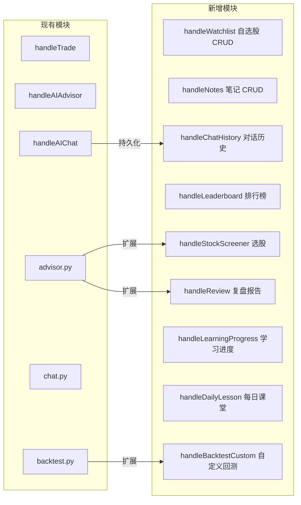

# 技术设计文档：YoungQuant 平台增强功能

## 概述

YoungQuant 平台增强功能旨在将现有的基础模拟交易系统升级为完整的"学习 → 实战 → 复盘"闭环平台。本次增强在现有技术栈（React + Vite + Tailwind CSS / Go/Gin / Python AI / SQLite）基础上进行扩展，核心新增能力包括：股票知识学习体系、AI 智能选股与盯盘、量化策略可视化回测、AI 复盘诊断、个人中心与笔记系统、风险提示系统。

现有系统已具备：
- 基础 K 线图表（`TradingChart.jsx` + `lightweight-charts`）
- 模拟交易撮合（`handleTrade` in `handlers.go`，支持 T+1、涨跌停限制、手续费）
- AI 行情分析（`ai/advisor.py`，DeepSeek API）
- AI 对话助手（`ai/chat.py`，多轮上下文）
- 用户注册/登录（JWT + bcrypt）
- 基础回测（`backtest.py`，向量化策略）
- SQLite 数据库（users / portfolios / holdings / trades / features / stock_bars）

本次增强在上述基础上进行增量开发，不破坏现有功能。

---

## 架构

### 整体架构图

```mermaid
graph TB
    subgraph 前端 React/Vite
        A[App.jsx 路由层] --> B[Dashboard 仪表盘]
        A --> C[LearningCenter 学习中心]
        A --> D[PersonalCenter 个人中心]
        A --> E[Leaderboard 排行榜]
        B --> F[TradingChart K线图]
        B --> G[ChatTerminal AI对话]
        B --> H[TradePanel 交易面板]
        B --> I[PortfolioAnalyzer 资产分析]
        C --> J[KnowledgeModule 知识模块]
        C --> K[KLineReplay K线回放]
        C --> L[DailyLesson 每日课堂]
        D --> M[WatchList 自选股]
        D --> N[NoteSystem 笔记]
        D --> O[ChatHistory 对话历史]
    end

    subgraph 后端 Go/Gin
        P[routes.go 路由] --> Q[handlers.go 处理器]
        Q --> R[services.go 业务逻辑]
        R --> S[(SQLite DB)]
        Q --> T[Python AI 子进程]
    end

    subgraph AI Python
        T --> U[advisor.py 行情分析/选股]
        T --> V[chat.py 对话助手]
        T --> W[news.py 新闻获取]
        T --> X[backtest.py 回测引擎]
    end

    前端 --> |HTTP REST API| 后端
    后端 --> |exec.Command| AI Python
```

### 新增模块与现有模块的关系



### 技术决策

1. **AI 调用方式保持不变**：继续使用 `exec.Command("python3", "-m", "ai.main", ...)` 调用 Python 子进程，避免引入 gRPC 或消息队列的复杂性。
2. **数据库继续使用 SQLite**：新增表通过 `migrate.go` 中的迁移脚本添加，不修改现有表结构。
3. **前端路由**：使用 React 状态管理（`useState`）实现页面切换，不引入 React Router，与现有 `App.jsx` 保持一致。
4. **回测结果格式**：新增 JSON 格式回测报告，与现有 CSV 格式并存，支持 round-trip 序列化。
5. **智能盯盘**：使用前端 `setInterval` 每 60 秒轮询 `/api/ai/advisor`，不引入 WebSocket。

---

## 组件与接口

### 新增后端 API 端点

#### 自选股管理
```
GET    /api/watchlist              # 获取自选股列表
POST   /api/watchlist              # 添加自选股 { symbol: string }
DELETE /api/watchlist/:symbol      # 删除自选股
```

#### 笔记系统
```
GET    /api/notes                  # 获取笔记列表（支持 ?symbol=&date= 筛选）
POST   /api/notes                  # 创建笔记 { content: string, symbol?: string }
PUT    /api/notes/:id              # 编辑笔记
DELETE /api/notes/:id              # 删除笔记
```

#### 对话历史
```
GET    /api/chat-history           # 获取对话历史（支持 ?date= 筛选，最多 100 条）
POST   /api/chat-history           # 保存对话记录（由 handleAIChat 内部调用）
```

#### 学习进度
```
GET    /api/learning/progress      # 获取学习进度
POST   /api/learning/progress      # 更新模块进度 { module: string, status: string }
GET    /api/learning/daily-lesson  # 获取今日课堂内容
POST   /api/learning/daily-lesson/read  # 标记已读
```

#### AI 选股与复盘
```
GET    /api/ai/screener            # AI 选股（支持 ?dimensions=trend,capital,sector,technical）
GET    /api/ai/review/:trade_id    # 单笔交易复盘报告
GET    /api/ai/review/summary      # 阶段性综合复盘（支持 ?period=week|month）
```

#### 自定义回测
```
POST   /api/backtest/custom        # 自定义参数回测
  Body: { symbol, start_date, end_date, strategy, params: { ma_fast, ma_slow, macd_fast, macd_slow, macd_signal, stop_loss, take_profit } }
```

#### 排行榜
```
GET    /api/leaderboard            # 排行榜（支持 ?page=&size=20）
GET    /api/leaderboard/me         # 当前用户排名
```

#### 热门股票与板块
```
GET    /api/market/hot-stocks      # 热门股票列表（缓存 60 秒）
GET    /api/market/sectors         # 板块热度排行
```

### 新增前端组件

| 组件 | 路径 | 功能 |
|------|------|------|
| `LearningCenter` | `src/pages/LearningCenter.jsx` | 学习中心主页面 |
| `KnowledgeModule` | `src/components/KnowledgeModule.jsx` | 技术指标图文讲解 |
| `KLineReplay` | `src/components/KLineReplay.jsx` | K 线历史回放 |
| `DailyLesson` | `src/components/DailyLesson.jsx` | 每日投资课堂 |
| `PersonalCenter` | `src/pages/PersonalCenter.jsx` | 个人中心 |
| `WatchList` | `src/components/WatchList.jsx` | 自选股管理 |
| `NoteEditor` | `src/components/NoteEditor.jsx` | 笔记编辑器 |
| `PortfolioChart` | `src/components/PortfolioChart.jsx` | 净值曲线图 |
| `ReviewReport` | `src/components/ReviewReport.jsx` | AI 复盘报告 |
| `StockScreener` | `src/components/StockScreener.jsx` | AI 选股面板 |
| `RiskGuard` | `src/components/RiskGuard.jsx` | 风险提示组件 |
| `TermTooltip` | `src/components/TermTooltip.jsx` | 专业名词悬浮解释 |
| `Leaderboard` | `src/pages/Leaderboard.jsx` | 收益率排行榜 |

### AI 模块新增接口

#### `ai/screener.py` - 选股模块
```python
class StockScreener:
    def screen(self, dimensions: list[str]) -> list[dict]:
        """
        返回格式：
        [{ "symbol": str, "name": str, "reason": str, "risk_level": "低"|"中"|"高",
           "trend_score": float, "capital_score": float }]
        最多返回 10 只
        """

#### `ai/reviewer.py` - 复盘模块
```python
class TradeReviewer:
    def review_trade(self, trade: dict, klines: list) -> dict:
        """
        返回格式：
        { "entry_timing": str, "hold_duration": str, "pnl_attribution": str,
          "score": int(1-5), "suggestion": str }
        """
    
    def review_summary(self, trades: list, period: str) -> dict:
        """
        返回格式：
        { "win_rate": float, "avg_hold_days": float, "max_profit": float,
          "max_loss": float, "common_patterns": list[str], "diagnosis": str }
        """
```

---

## 数据模型

### 新增数据库表

#### `watchlist` - 自选股
```sql
CREATE TABLE IF NOT EXISTS watchlist (
    id INTEGER PRIMARY KEY AUTOINCREMENT,
    user_id INTEGER NOT NULL,
    symbol TEXT NOT NULL,
    created_at DATETIME DEFAULT CURRENT_TIMESTAMP,
    UNIQUE(user_id, symbol),
    FOREIGN KEY(user_id) REFERENCES users(id)
);
```

#### `notes` - 笔记
```sql
CREATE TABLE IF NOT EXISTS notes (
    id INTEGER PRIMARY KEY AUTOINCREMENT,
    user_id INTEGER NOT NULL,
    symbol TEXT,
    content TEXT NOT NULL,
    created_at DATETIME DEFAULT CURRENT_TIMESTAMP,
    updated_at DATETIME DEFAULT CURRENT_TIMESTAMP,
    FOREIGN KEY(user_id) REFERENCES users(id)
);
```

#### `chat_history` - 对话历史
```sql
CREATE TABLE IF NOT EXISTS chat_history (
    id INTEGER PRIMARY KEY AUTOINCREMENT,
    user_id INTEGER NOT NULL,
    symbol TEXT,
    role TEXT NOT NULL,       -- 'user' | 'assistant'
    content TEXT NOT NULL,
    created_at DATETIME DEFAULT CURRENT_TIMESTAMP,
    FOREIGN KEY(user_id) REFERENCES users(id)
);
```

#### `learning_progress` - 学习进度
```sql
CREATE TABLE IF NOT EXISTS learning_progress (
    id INTEGER PRIMARY KEY AUTOINCREMENT,
    user_id INTEGER NOT NULL,
    module TEXT NOT NULL,     -- 模块名称
    status TEXT DEFAULT 'not_started',  -- 'not_started'|'in_progress'|'completed'
    read_at DATETIME,
    duration_seconds INTEGER DEFAULT 0,
    UNIQUE(user_id, module),
    FOREIGN KEY(user_id) REFERENCES users(id)
);
```

#### `daily_lessons` - 每日课堂内容
```sql
CREATE TABLE IF NOT EXISTS daily_lessons (
    id INTEGER PRIMARY KEY AUTOINCREMENT,
    day_index INTEGER UNIQUE NOT NULL,  -- 0-59，60天轮播
    category TEXT NOT NULL,  -- '技术分析'|'基本面分析'|'交易心理'|'风险管理'
    title TEXT NOT NULL,
    content TEXT NOT NULL,
    detail_module TEXT        -- 关联的知识模块
);
```

#### `lesson_reads` - 课堂阅读记录
```sql
CREATE TABLE IF NOT EXISTS lesson_reads (
    user_id INTEGER NOT NULL,
    lesson_id INTEGER NOT NULL,
    read_at DATETIME DEFAULT CURRENT_TIMESTAMP,
    PRIMARY KEY(user_id, lesson_id),
    FOREIGN KEY(user_id) REFERENCES users(id),
    FOREIGN KEY(lesson_id) REFERENCES daily_lessons(id)
);
```

#### `backtest_reports` - 回测报告（JSON 格式）
```sql
CREATE TABLE IF NOT EXISTS backtest_reports (
    id INTEGER PRIMARY KEY AUTOINCREMENT,
    user_id INTEGER NOT NULL,
    symbol TEXT NOT NULL,
    strategy TEXT NOT NULL,
    params_json TEXT NOT NULL,   -- 策略参数 JSON
    result_json TEXT NOT NULL,   -- 回测结果 JSON
    created_at DATETIME DEFAULT CURRENT_TIMESTAMP,
    FOREIGN KEY(user_id) REFERENCES users(id)
);
```

### 回测报告 JSON 结构

```typescript
interface BacktestReport {
  symbol: string;
  strategy: "ma_cross" | "macd_zero";
  params: {
    ma_fast?: number;      // 5-120
    ma_slow?: number;      // 5-120
    macd_fast?: number;
    macd_slow?: number;
    macd_signal?: number;
    stop_loss?: number;    // 0.01-0.20
    take_profit?: number;  // 0.01-0.50
    start_date: string;
    end_date: string;
  };
  metrics: {
    annual_return: number;   // 年化收益率
    max_drawdown: number;    // 最大回撤
    win_rate: number;        // 胜率
    sharpe: number;          // 夏普比率
    total_trades: number;    // 总交易次数
  };
  curve: Array<{
    date: string;
    strategy: number;  // 策略净值
    hold: number;      // 持有不动净值
  }>;
  signals: Array<{
    date: string;
    action: "BUY" | "SELL";
    price: number;
  }>;
}
```

### 现有数据模型扩展

`users` 表新增字段（通过 ALTER TABLE 迁移）：
```sql
ALTER TABLE users ADD COLUMN is_public INTEGER DEFAULT 1;  -- 排行榜可见性
ALTER TABLE users ADD COLUMN learning_pct REAL DEFAULT 0.0; -- 学习完成百分比
```

`portfolios` 表新增字段：
```sql
ALTER TABLE portfolios ADD COLUMN equity_history_json TEXT DEFAULT '[]'; -- 净值历史 JSON
```

---


## 正确性属性

*属性（Property）是在系统所有有效执行中都应成立的特征或行为——本质上是对系统应该做什么的形式化陈述。属性是人类可读规范与机器可验证正确性保证之间的桥梁。*

### 属性 1：选股结果完整性

*对于任意*选股请求，返回的候选股票列表长度应 <= 10，且每只股票的 `reason` 字段长度 <= 50 字，`risk_level` 字段值在 `{低, 中, 高}` 集合中。

**验证：需求 4.1、4.3**

---

### 属性 2：AI 分析报告结构约束

*对于任意*有效的 K 线数据集，AI 分析报告应包含 `signal`（值为 BUY/SELL/HOLD 之一）、`confidence`（值在 [0.0, 1.0] 范围内）、`reason`（长度 <= 100 字）、`risk`（长度 <= 50 字）四个字段。

**验证：需求 3.2**

---

### 属性 3：API 失败时的默认报告（边界条件）

*对于任意*导致外部 API 调用失败的情况，AI 分析器应返回 `signal = "HOLD"`、`confidence = 0.5` 的默认报告，且 `reason` 字段非空。

**验证：需求 3.4**

---

### 属性 4：选股数据不足排除（边界条件）

*对于任意*数据少于 20 根 K 线的股票，选股结果中不应包含该股票。

**验证：需求 4.4**

---

### 属性 5：回测报告字段完整性

*对于任意*有效的回测参数（symbol、strategy、时间范围），回测报告应包含 `annual_return`、`max_drawdown`、`win_rate`、`sharpe`、`curve`（含策略净值和基准净值）五项指标。

**验证：需求 5.2**

---

### 属性 6：回测结果 JSON 序列化 Round-Trip

*对于任意*有效的回测结果对象，将其序列化为 JSON 字符串后再反序列化，应得到与原始对象等价的结果（所有数值字段误差 < 1e-9）。

**验证：需求 19.4**

---

### 属性 7：回测数据不足时的错误处理（边界条件）

*对于任意*时间范围内有效交易日数量 < 30 的回测请求，系统应返回错误响应，而非空结果或异常。

**验证：需求 5.4、5.5**

---

### 属性 8：对话历史截断

*对于任意*包含超过 20 条消息的对话会话，传递给 AI 模型的历史消息数量应 <= 20（保留最近的 20 条）。

**验证：需求 6.1**

---

### 属性 9：AI 对话上下文注入

*对于任意*发送给 AI 对话助手的请求，构建的 context 字符串应包含当前股票代码和最新价格信息。

**验证：需求 6.3**

---

### 属性 10：对话历史持久化 Round-Trip

*对于任意*已登录用户的对话记录，保存到数据库后再查询，应能取回包含相同 `role`、`content`、`symbol` 字段的记录。

**验证：需求 6.5、18.2**

---

### 属性 11：游客消息数量限制（边界条件）

*对于任意*游客用户，当其在单次会话中发送第 6 条消息时，系统应拒绝该请求。

**验证：需求 6.6**

---

### 属性 12：复盘报告结构完整性

*对于任意*已完成的卖出交易，生成的复盘报告应包含 `entry_timing`、`hold_duration`、`pnl_attribution` 三个维度字段，以及 `score`（值在 [1, 5] 范围内）和 `suggestion`（长度 <= 100 字）。

**验证：需求 7.1、7.2**

---

### 属性 13：综合复盘报告字段完整性

*对于任意*时间段内的交易记录集合，生成的综合诊断报告应包含 `win_rate`、`avg_hold_days`、`max_profit`、`max_loss`、`common_patterns`（列表，长度 >= 1）五项指标。

**验证：需求 7.3、7.4**

---

### 属性 14：新用户初始资金

*对于任意*新注册用户，其模拟账户的初始现金应等于 100,000.0 元人民币。

**验证：需求 8.1**

---

### 属性 15：涨跌停价格验证

*对于任意*买入委托，若委托价格 > 前收盘价 × 1.10 或 < 前收盘价 × 0.90，系统应拒绝该委托并返回错误信息。

**验证：需求 8.3**

---

### 属性 16：T+1 规则执行（边界条件）

*对于任意*当日买入的股票，在同一交易日内尝试卖出时，系统应拒绝该委托并返回 T+1 限制错误。

**验证：需求 8.4、8.5**

---

### 属性 17：手续费计算正确性

*对于任意*成交金额 `amount`，计算出的手续费应等于 `amount × 0.0003`（误差 < 1e-9）。

**验证：需求 8.6**

---

### 属性 18：资金不足拒绝（边界条件）

*对于任意*买入委托，若账户余额 < 委托金额 + 手续费，系统应拒绝该委托并返回"资金不足"错误。

**验证：需求 8.7**

---

### 属性 19：资产计算不变量

*对于任意*账户状态，总资产应等于可用现金加上所有持仓的市值之和（`total_assets = cash + Σ(shares_i × price_i)`），总盈亏百分比应等于 `(total_assets - 100000) / 100000 × 100`。

**验证：需求 9.1、9.2**

---

### 属性 20：交易记录持久化 Round-Trip

*对于任意*已执行的交易，保存到数据库后再查询，应能取回包含相同 `date`、`symbol`、`action`、`price`、`shares`、`fee` 字段的记录。

**验证：需求 10.1、18.1**

---

### 属性 21：交易记录筛选正确性

*对于任意*筛选条件（时间范围、股票代码、操作方向），返回的交易记录中每条记录都应满足该筛选条件。

**验证：需求 10.2**

---

### 属性 22：密码安全存储

*对于任意*注册请求，数据库中存储的密码字段不应等于用户提交的原始密码（应为 bcrypt 哈希），且使用 bcrypt 验证原始密码应返回成功。

**验证：需求 11.1、11.2**

---

### 属性 23：JWT Token 有效期

*对于任意*登录请求，生成的 JWT Token 的过期时间应在当前时间 + 24 小时（普通登录）或 + 7 天（记住我）的合理误差范围内（±60 秒）。

**验证：需求 11.3**

---

### 属性 24：重复邮箱注册拒绝（边界条件）

*对于任意*已注册的邮箱，再次使用该邮箱注册时，系统应返回错误，且数据库中该邮箱的用户记录数量仍为 1。

**验证：需求 11.4**

---

### 属性 25：笔记内容长度限制与持久化

*对于任意*长度超过 2,000 字的笔记内容，保存请求应被拒绝；对于任意有效笔记，保存后查询应能取回包含相同 `content`、`symbol`、`created_at` 字段的记录。

**验证：需求 13.1、13.2**

---

### 属性 26：术语识别正确性

*对于任意*包含已知专业术语的文本字符串，术语识别函数应返回该术语在文本中的位置（起始索引和结束索引）。

**验证：需求 2.2**

---

### 属性 27：术语查询完整性

*对于任意*已收录的专业术语，查询函数应返回包含 `definition`（定义）、`usage`（使用场景）、`related_terms`（相关术语列表）三个字段的结果。

**验证：需求 2.3**

---

### 属性 28：自定义回测参数验证

*对于任意*自定义回测请求，若均线周期参数不在 [5, 120] 范围内，或止损比例不在 [0.01, 0.20] 范围内，或止盈比例不在 [0.01, 0.50] 范围内，系统应返回参数验证错误。

**验证：需求 19.1、19.2**

---

## 错误处理

### 后端错误处理策略

| 错误场景 | HTTP 状态码 | 响应格式 | 处理方式 |
|---------|------------|---------|---------|
| JWT Token 过期/无效 | 401 | `{"error": "Invalid token"}` | 前端引导重新登录 |
| 资金不足 | 400 | `{"status": "error", "msg": "资金不足"}` | 前端展示错误提示 |
| 涨跌停限制 | 400 | `{"status": "error", "msg": "涨停/跌停限制：..."}` | 前端展示具体限制信息 |
| T+1 限制 | 400 | `{"status": "error", "msg": "T+1 限制：..."}` | 前端展示限制说明 |
| AI API 调用失败 | 200 | `{"signal": "HOLD", "confidence": 0.5, ...}` | 降级返回默认报告 |
| 数据库写入失败 | 500 | `{"error": "..."}` | 记录错误日志，返回失败提示 |
| 回测数据不足 | 400 | `{"error": "数据不足：有效交易日少于 30 个"}` | 前端展示错误说明 |
| 笔记内容超长 | 400 | `{"error": "笔记内容不能超过 2000 字"}` | 前端实时字数提示 |
| 重复邮箱注册 | 400 | `{"error": "用户已存在"}` | 前端展示注册失败提示 |
| 访问频率过高 | 429 | `{"error": "访问频率过高，请稍后再试"}` | 前端展示冷却提示 |

### AI 模块降级策略

```python
# ai/advisor.py 中已实现的降级模式
try:
    result = call_deepseek_api(...)
    return parse_result(result)
except Exception as e:
    return {
        "signal": "HOLD",
        "confidence": 0.5,
        "reason": f"分析异常: {str(e)[:80]}",
        "risk": "API 响应连接中断或文件缺失",
        "expert_tip": "建议稍后再试或检查 .env 配置"
    }
```

新增的 `screener.py` 和 `reviewer.py` 遵循相同的降级模式。

### 数据库事务保证

所有涉及多表写入的操作（如交易撮合同时更新 holdings、trades、portfolios）使用 SQLite 事务：

```go
tx, _ := db.Begin()
defer tx.Rollback()
// ... 多步写入操作 ...
tx.Commit()
```

---

## 测试策略

### 双轨测试方法

本项目采用单元测试与属性测试相结合的方式，两者互补，共同保证系统正确性：

- **单元测试**：验证具体示例、边界条件和错误处理
- **属性测试**：验证对所有输入都成立的普遍性质

### 后端测试（Go）

使用 Go 标准库 `testing` 包进行单元测试，使用 [`pgregory.net/rapid`](https://github.com/pgregory/rapid) 进行属性测试。

```go
// 属性测试示例：手续费计算正确性（属性 17）
// Feature: youngquant-platform-enhancement, Property 17: 手续费计算正确性
func TestFeeCalculation(t *testing.T) {
    rapid.Check(t, func(t *rapid.T) {
        amount := rapid.Float64Range(100, 1000000).Draw(t, "amount")
        fee := amount * 0.0003
        calculated := calculateFee(amount)
        if math.Abs(calculated - fee) > 1e-9 {
            t.Fatalf("fee mismatch: expected %v, got %v", fee, calculated)
        }
    })
}
```

**属性测试配置**：每个属性测试最少运行 100 次迭代。

### AI 模块测试（Python）

使用 [`hypothesis`](https://hypothesis.readthedocs.io/) 进行属性测试，`pytest` 进行单元测试。

```python
# 属性测试示例：回测结果 JSON Round-Trip（属性 6）
# Feature: youngquant-platform-enhancement, Property 6: 回测结果 JSON 序列化 Round-Trip
from hypothesis import given, settings
from hypothesis import strategies as st

@given(st.builds(BacktestReport, ...))
@settings(max_examples=100)
def test_backtest_report_roundtrip(report):
    serialized = json.dumps(report)
    deserialized = json.loads(serialized)
    assert deserialized == report
```

### 前端测试（React）

使用 `vitest` + `@testing-library/react` 进行组件测试。

```javascript
// 示例：术语识别正确性（属性 26）
// Feature: youngquant-platform-enhancement, Property 26: 术语识别正确性
import { describe, it, expect } from 'vitest'
import { identifyTerms } from '../lib/knowledgeBase'

describe('术语识别', () => {
  it('应识别文本中的已知术语', () => {
    const text = '当MACD出现金叉时，通常是买入信号'
    const result = identifyTerms(text)
    expect(result.some(t => t.term === 'MACD')).toBe(true)
    expect(result.some(t => t.term === '金叉')).toBe(true)
  })
})
```

### 测试覆盖矩阵

| 属性编号 | 测试类型 | 测试层 | 测试库 |
|---------|---------|-------|-------|
| 属性 1 | 属性测试 | Python | hypothesis |
| 属性 2 | 属性测试 | Python | hypothesis |
| 属性 3 | 边界条件单元测试 | Python | pytest |
| 属性 4 | 边界条件单元测试 | Python | pytest |
| 属性 5 | 属性测试 | Python | hypothesis |
| 属性 6 | 属性测试（Round-Trip） | Python | hypothesis |
| 属性 7 | 边界条件单元测试 | Python | pytest |
| 属性 8 | 属性测试 | Python | hypothesis |
| 属性 9 | 属性测试 | Python | hypothesis |
| 属性 10 | 属性测试（Round-Trip） | Go | rapid |
| 属性 11 | 边界条件单元测试 | Go | testing |
| 属性 12 | 属性测试 | Python | hypothesis |
| 属性 13 | 属性测试 | Python | hypothesis |
| 属性 14 | 属性测试 | Go | rapid |
| 属性 15 | 属性测试 | Go | rapid |
| 属性 16 | 边界条件单元测试 | Go | testing |
| 属性 17 | 属性测试 | Go | rapid |
| 属性 18 | 边界条件单元测试 | Go | testing |
| 属性 19 | 属性测试（不变量） | Go | rapid |
| 属性 20 | 属性测试（Round-Trip） | Go | rapid |
| 属性 21 | 属性测试 | Go | rapid |
| 属性 22 | 属性测试 | Go | rapid |
| 属性 23 | 属性测试 | Go | rapid |
| 属性 24 | 边界条件单元测试 | Go | testing |
| 属性 25 | 属性测试 | Go | rapid |
| 属性 26 | 属性测试 | JavaScript | vitest |
| 属性 27 | 属性测试 | JavaScript | vitest |
| 属性 28 | 属性测试 | Go | rapid |

### 单元测试重点

单元测试应聚焦于以下场景（避免与属性测试重复）：

1. **集成点测试**：Go 调用 Python 子进程的完整流程
2. **数据库迁移测试**：新增表结构的正确性
3. **路由鉴权测试**：受保护端点在无 Token 时返回 401
4. **前端组件渲染测试**：学习中心页面包含五类技术指标模块（需求 1.1）
5. **知识库内容测试**：知识库术语数量 >= 200（需求 2.1）
6. **K 线形态案例测试**：教学案例数量 >= 10（需求 1.6）
